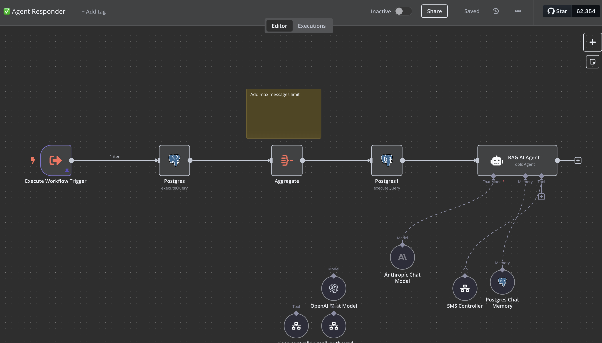
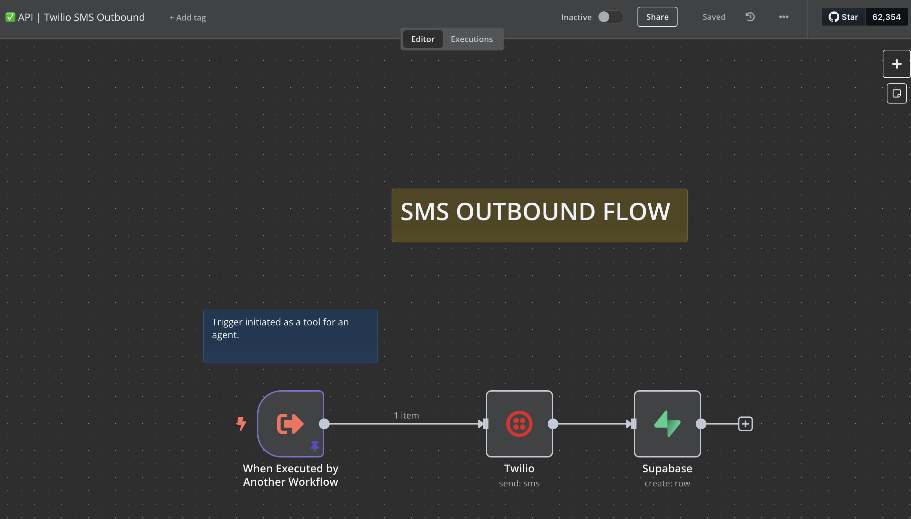
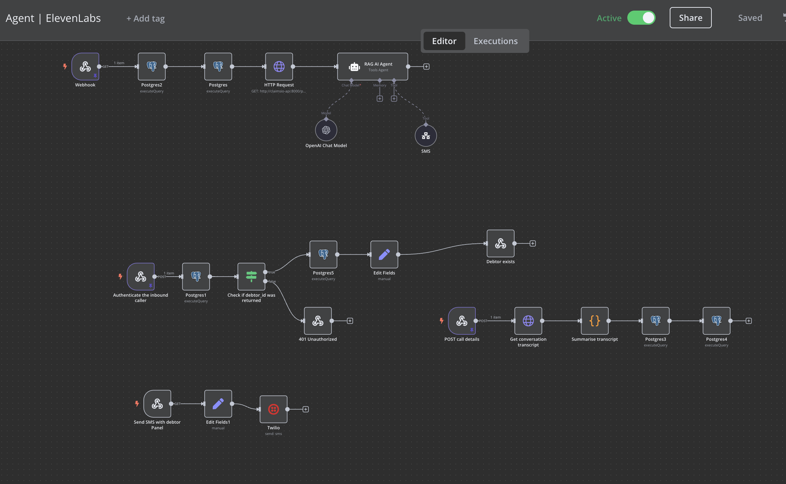
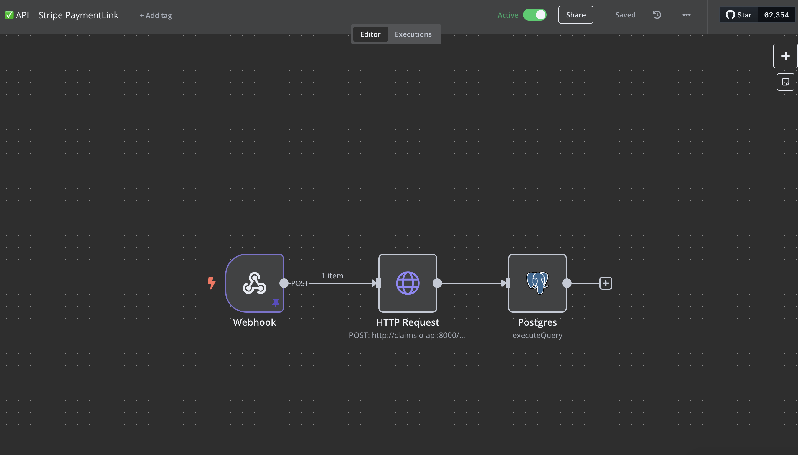
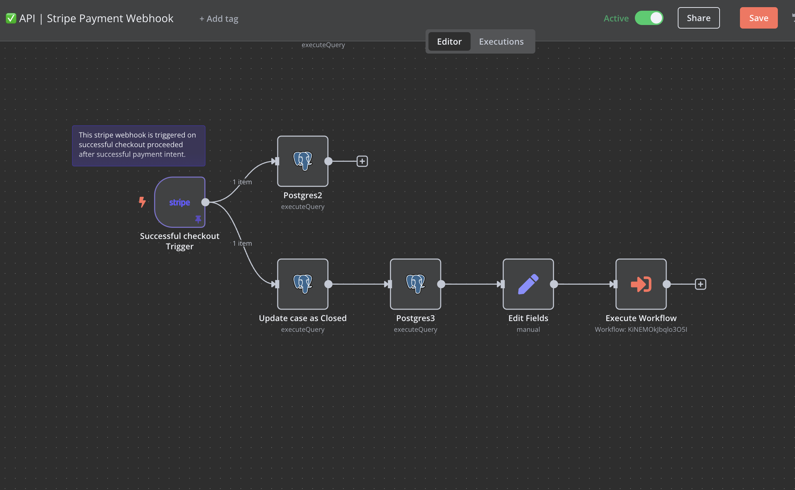
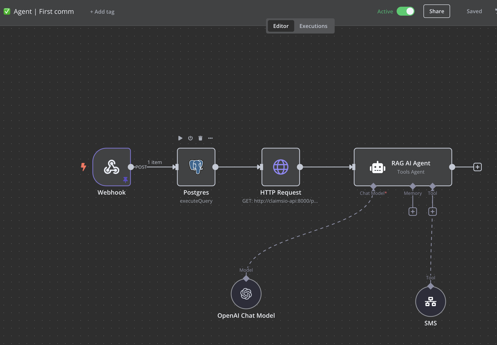

# elevenlabs-hackathon25

## Stack

- Supabase
- Twillio
- Loveable
- Eleven Labs
- N8N
- Stripe
- Go
- JS
- React
- Docker

## N8N workflows

### Agent Responder

Handles incoming calls through Twilio, integrates with ElevenLabs for voice processing, and manages conversation context.

### SMS Processing

Manages incoming and outgoing SMS communications through Twilio, with automated response handling.

### elevenlabs agent

Tools and agents for ElevenLabs.

### Stripe

Handles payment intents through Stripe and updates case status accordingly.

### First compliant communication

Handles the first compliant communication to the debtor.

## Roadmap

TODO:

- Twillio x Eleven Labs
    - ~~Inbound setup~~
    - ~~Outbound setup~~
    - ~~Agents + their settings in n8n/make~~
    - ~~Tools for agents~~
        - ~~sent an sms~~
        - ~~summarise the event~~
    - Edge cases:
        - ~~call ended sooner~~
- SMS
    - ~~Twillio inbound setup~~
    - ~~Twillio outbound setup~~
    - ~~Agents to analyse and respond~~
- Agents / workflows:
    - Pro-active outreach agentic flow
        - ~~Check the context, decide whether to contact or not~~
        - ~~Use SMS or 11labs to contact~~
    - Reactive inbound answer agentic flow
        - ~~Analyse the response~~
        - ~~Use the same channel to send the response~~
    - ~~SMS~~
    - ~~Calls~~
    - ~~Database access and context summary~~
    - ~~Add a new debtor~~
    - ~~Close a case~~
    - ~~Fetch the context of the debtor/case~~

Other:

~~- Supabase database scheme~~
- ~~Stripe payment intent setup~~
-

Panels:

~~- Admin / Add a debtor panel~~
   ~~- Auth (hardcoded)~~
    ~~- Add a new debtor~~
    ~~- Compliance?~~
    ~~- Analyze the progress of the collection~~
- ~~Debtor panel~~
